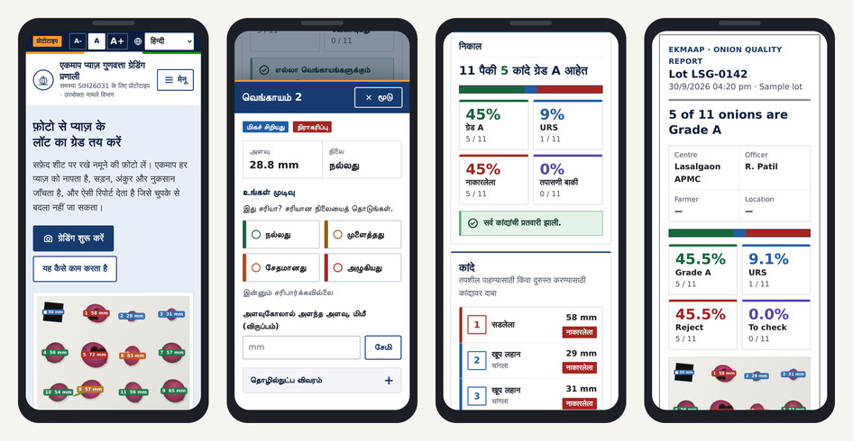
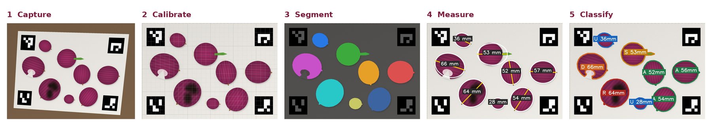
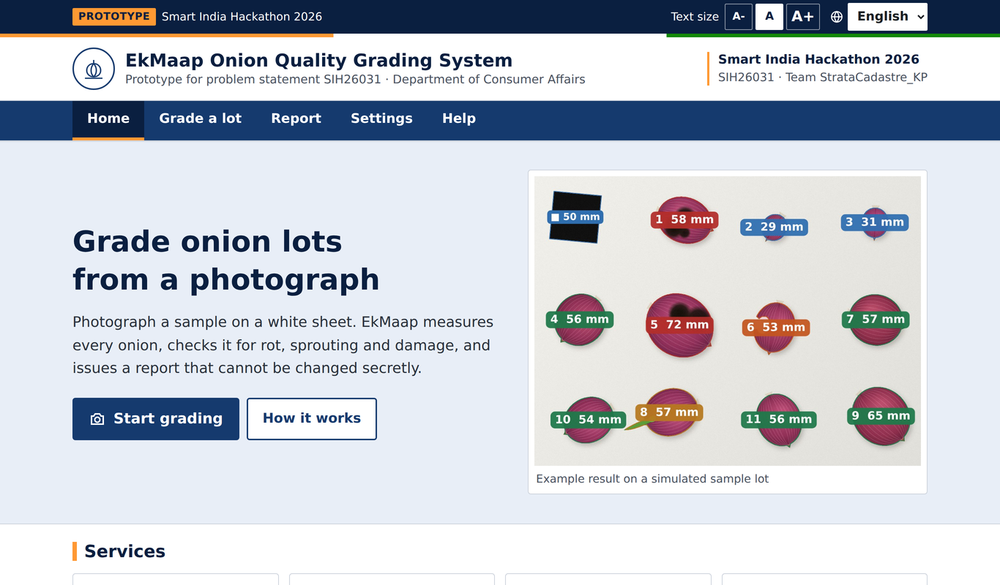
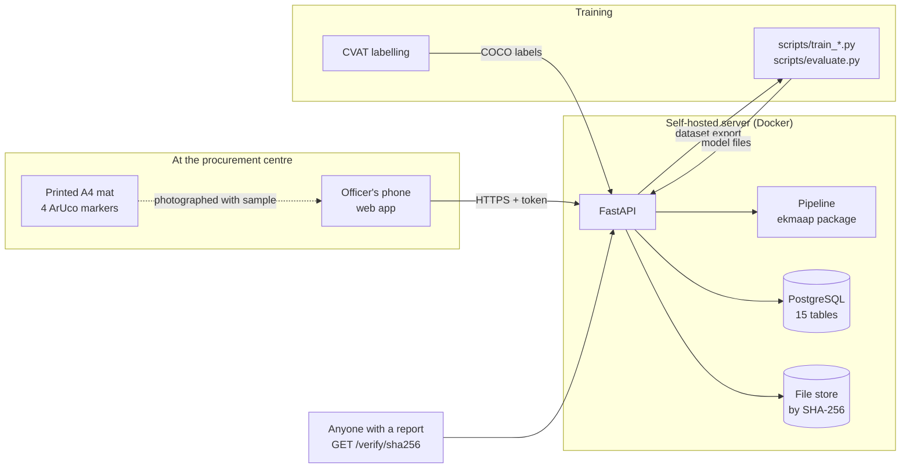

<div align="center">

# EkMaap

### One photo. Every onion measured. A grade nobody can quietly change.

AI-based onion quality grading for procurement centres — **Smart India Hackathon 2026 · SIH26031**<br>
Department of Consumer Affairs, Ministry of Consumer Affairs, Food and Public Distribution

[](https://github.com/kartikpathak100/ekmaap/actions/workflows/ci.yml)


**[▶ Open the live demo](https://kartikpathak100.github.io/ekmaap/)** &nbsp;·&nbsp; [Final report (PDF)](report/EkMaap_SIH26031_Final_Report.pdf) &nbsp;·&nbsp; [Pitch deck](presentation/SIH26031_StrataCadastre_KP_v4.pdf) &nbsp;·&nbsp; [Architecture](docs/architecture.md)



</div>

---

## The problem

At procurement centres, onions are graded **by eye**. Two officers can look at the same crate and write down different Grade A / URS percentages, and nothing records what was actually seen. That is the dispute SIH26031 asks us to remove.

## What EkMaap does

An officer lays a sample on a mat, takes **one photo**, and EkMaap:

1. **finds every onion** (touching ones are split apart),
2. **measures each one in millimetres** against a reference on the mat,
3. **decides its condition** — sound, damaged, sprouted or rotten — and sends anything it is unsure about to the officer instead of guessing,
4. applies a **versioned grading rule set** → Grade A / URS / Reject percentages,
5. issues a **report fingerprinted with SHA-256** (QR code on the PDF). Change one number or one photo byte and verification fails — so a farmer has something to point to in a dispute.

<div align="center">
<br>
<sub>The pipeline stages, run on a <b>synthetic</b> test photo from our own generator (<code>ekmaap/synth.py</code>) — not a real onion.</sub>
</div>

## Why this is built the way it is

| Design choice | Why |
| --- | --- |
| **Works in any phone browser** — the demo is one HTML file, no install | Procurement centres cannot be asked to install an app or buy hardware |
| **Seven languages** (English, Hindi, Marathi, Gujarati, Tamil, Telugu, Kannada), large touch targets, text-size control, light high-contrast theme | The person at the counter is often older, reading in sunlight, and not working in English |
| **Unsure → officer.** Borderline onions are never silently graded | A wrong grade costs a farmer money; a flag costs seconds |
| **The grading rules are data, not code** (versioned rule sets) | The official specification is not public; rules must change without a software release |
| **Append-only history.** Re-analysis and re-grade add rows; old reports stay explainable exactly | Disputes are decided on what was true *when the report was issued* |
| **Model output, officer decision and training truth live in three separate tables** | The model is never silently "corrected"; training data never mixes with unreviewed predictions |
| **Same pipeline code** in the API, in training and in evaluation | Test numbers describe the deployed system |

## Try it in 60 seconds

1. Open the **[live demo](https://kartikpathak100.github.io/ekmaap/)** (or open `demo/EkMaap_demo.html` locally — no server needed).
2. Pick a language from the top bar.
3. **Grade a lot → Try a sample.** A synthetic photo is analysed in your browser; tap any onion to see why it got its label.
4. **Next: make report → Issue report.** Open the **Report** tab, then use the **Verify** card to confirm the fingerprint — and try editing a number to watch verification fail.

<div align="center">

</div>

## What we measured

Everything below comes from code in this repository (`demo/test_results.json`, `tests/`). **All of it is on synthetic photos our own generator drew, where the true size and condition of every onion is known.**

| Test (browser demo pipeline) | Photos | Onions found | Mean size error | Condition correct |
| --- | --- | --- | --- | --- |
| Separate onions | 20 | 220 / 220 | 0.32 mm | 220 / 220 |
| Touching pairs | 20 | 200 / 200 | 0.26 mm | 200 / 200 |
| JPEG copies — plain, blurred, dim, warm, bright | 10 each | 110 / 110 each | 0.36 – 0.77 mm | 110 / 110 each |

Also verified: tampering with one number **or one photo bit** is detected; with the size reference missing, sizes are reported "not found" and sound onions go to officer review rather than being graded; the interface was driven in headless Chromium in all 7 languages at desktop and 390 px phone width with no layout overflow or script errors; the Python pipeline and the full API workflow (lot → photo → review → report → PDF → verify → dispute → superseding report) pass their automated tests on PostgreSQL.

## Current status

- **Not yet validated on real onions.** The initial hand-set thresholds have not been tuned on real photographs. The synthetic results above show that the code behaves as designed; they are not a measure of accuracy on real onions.
- **Real-data training is the next stage.** [`docs/training.md`](docs/training.md) is the full loop: print the mat → photograph real onions → prelabel → correct in CVAT → split **by photo** → train → evaluate on photos the model never saw. `scripts/evaluate.py` produces every number we will quote.
- Grade limits in the demo rule set (45 mm / 35 mm) come from 2026 news reports, **not** the official specification — they are editable data for exactly that reason.
- Percentages are by **count**, not weight. One view per onion: hidden-side defects and internal rot are not visible.
- The browser demo uses a printed 50 mm black card for scale; the full server pipeline uses an **A4 mat with four ArUco markers**, which also corrects phone tilt.

## Architecture



| | |
| --- | --- |
| **Pipeline** (`ekmaap/`) | ArUco calibration → segmentation (classical baseline · pixel-forest · optional YOLO-seg; watershed splits touching onions) → size (moment ellipse, convex hull for dented outlines, ruler-fitted correction) → condition (34-feature random forest; low confidence → review) → rule set → grade |
| **API** (`backend/app/`) | FastAPI, 45 endpoints, roles: officer / supervisor / labeller / admin, public report verification |
| **Database** (`db/schema.sql`) | PostgreSQL 14+, 15 tables, append-only history, one active rule set and one active model per kind enforced by partial unique indexes |
| **Security** | PBKDF2 password hashes, HMAC-signed expiring tokens, role checks on every endpoint, farmer details refused without recorded consent (DPDP Act 2023), audit log |

Deeper docs: [architecture](docs/architecture.md) · [database](docs/database.md) · [API](docs/api.md) · [training](docs/training.md) · [OpenAPI spec](docs/openapi.json)

## Repository map

```
ekmaap/         the pipeline, shared by API and training: calibration, segmentation, measure, features,
                classifier, rules, pipeline, dataset, evaluate, coco, synth (synthetic test images)
backend/        FastAPI app: models, routers, services (engine, reports), security, storage
frontend/       officer web app, served by the API at /
scripts/        make_mat, prelabel, train_segmenter, train_classifier, fit_size_calibration, evaluate,
                coco_to_yolo, train_yolo_seg (GPU, optional), seed_demo, make_synthetic, dump_api
db/             schema.sql, generated from backend/app/models.py (a test fails if they drift)
tests/          pytest: pipeline on synthetic photos + full API workflow on PostgreSQL
demo/           EkMaap_demo.html — standalone client-side demo (7 languages, accessible portal design),
                its Playwright test scripts and test_results.json; offline_demo_v0.html is the superseded first version
presentation/   the SIH pitch deck
report/         the final project report (PDF)
notebooks/      Colab notebook for the optional GPU model
```

## Run it

**With Docker**
```bash
cp .env.example .env            # set passwords and secret
docker compose up -d --build    # http://localhost:8000 (app) and /docs (API)
python scripts/seed_demo.py --url http://localhost:8000 --admin admin --password <EKMAAP_ADMIN_PASSWORD>
```

**Without Docker**
```bash
python -m venv .venv && . .venv/bin/activate && pip install -r requirements.txt
createdb ekmaap && psql ekmaap -f db/schema.sql
export EKMAAP_DATABASE_URL=postgresql+psycopg://$USER@localhost/ekmaap EKMAAP_SECRET_KEY=dev EKMAAP_ADMIN_LOGIN=admin EKMAAP_ADMIN_PASSWORD=admin-pass-123
uvicorn backend.app.main:app --reload
python scripts/seed_demo.py --url http://localhost:8000 --admin admin --password admin-pass-123
python scripts/make_mat.py      # print ekmaap_mat.pdf at 100 % scale
```

**Train the loop on synthetic data** (only proves the scripts run end to end)
```bash
make synthetic && make train D=data/synthetic && make evaluate D=data/synthetic
```

**Tests** — `EKMAAP_TEST_DATABASE_URL=postgresql+psycopg://user@localhost/ekmaap_test python -m pytest -q` (the test database is wiped). Browser-demo tests: `cd demo && node test2.mjs` (needs Node + Playwright + Chromium).

### Not yet exercised
`docker compose` image build; YOLO-seg training/inference (no PyTorch available while building); a real CVAT export; anything on **real** onions.

## Team

**StrataCadastre_KP** — Smart India Hackathon 2026, problem statement **SIH26031**.

## Licence

[MIT](LICENSE). The optional `ultralytics` dependency (YOLO-seg, not installed by default) is AGPL-3.0.
