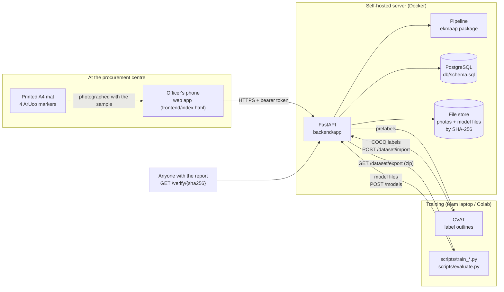

# System architecture

EkMaap grades onions from a photo. The officer's phone takes one photo of the sample on a printed mat. A server finds every onion, measures it in millimetres and decides its condition. It then applies a versioned rule set and issues a report with a SHA-256 fingerprint that anyone can verify. Every decision is stored with the exact models and rules that made it.

## Components



| Component | What it does | Where |
| --- | --- | --- |
| Officer web app | Log in, create a lot, take photos, confirm flagged onions, issue and download the report. Works in any phone browser; no install. | `frontend/index.html` |
| API | Auth and roles, lots, photos, reviews, reports, disputes, public verification, dataset, model registry, evaluations. | `backend/app/` |
| Pipeline | Photo → calibration → segmentation → measurement → features → condition → rule set → grade. The same code runs in the API and in training/evaluation, so test numbers describe the deployed system. | `ekmaap/` |
| PostgreSQL | Everything that decided a grade: analyses, detections, officer reviews, rule sets, model versions, reports, disputes, audit log. | `db/schema.sql` |
| File store | Photos and model files, stored once by content hash. Swap for S3/MinIO in production. | `backend/app/storage.py` |
| CVAT | Free, self-hostable labelling tool; draw/correct onion outlines. Any tool that reads and writes COCO works. | external |
| Training scripts | Train on the exported dataset, evaluate on held-out photos, produce model files. | `scripts/` |

## What happens to one photo

```mermaid
sequenceDiagram
  participant O as Officer app
  participant A as API
  participant E as Pipeline
  participant D as PostgreSQL
  O->>A: POST /lots/{id}/photos (photo)
  A->>A: store bytes by SHA-256
  A->>E: analyse(photo, active models, active rule set)
  E->>E: 1 find 4 ArUco markers -> homography -> top-down image, 3 px per mm
  E->>E: 2 segment onions (classical / pixel forest / YOLO-seg), split touching ones
  E->>E: 3 measure widest diameter (mm), apply size calibration
  E->>E: 4 features -> condition + probability; low confidence -> review
  E->>E: 5 rule set -> Grade A / URS / Reject / Review
  E-->>A: onions + summary + calibration quality
  A->>D: analyses + detections (with model and rule versions)
  A-->>O: annotated result; flagged onions first
  O->>A: POST /detections/{id}/reviews (officer decision)
  O->>A: POST /lots/{id}/reports
  A->>D: report = canonical JSON + SHA-256 (refused while reviews pending)
  A-->>O: PDF with QR code of the fingerprint
```

## Pipeline stages and what each one needs

| Stage | Method | Trained on | Fails when |
| --- | --- | --- | --- |
| Calibration | OpenCV ArUco, 4-16 corner points → homography to the mat's millimetre grid. Corrects scale **and tilt**. | nothing | a marker is covered, folded or out of frame; the mat was printed at the wrong scale |
| Segmentation | `classical`: colour distance from the paper (baseline, untrained). `pixel_forest`: random forest on 17 colour/texture features per pixel with an onion-boundary class; CPU, minutes to train. `yolo_seg`: optional GPU model. Touching onions split by watershed. | labelled outlines | untrained on your light, background and onion variety; onions stacked on each other |
| Size | ellipse from image moments of the trimmed body (hull for dented outlines), then `true = a × measured + b` fitted from ruler data | ruler-measured onions | onions standing on end; phone far from straight above |
| Condition | random forest on 34 features (colour stats, dark/green/pale shares, hue and texture histograms, shape). Below the confidence threshold → officer review. | labelled conditions | defects on the hidden side; internal rot; conditions with few examples |
| Grade | versioned rule set: size limits + condition → grade (worst wins) | nothing: it is policy | rule set does not match the official specification |

## Deployment

- `docker compose up` starts PostgreSQL and the API. The API serves the web app on the same port. See the README.
- Photos are processed on the server; a phone only uploads. A typical upload is 2–5 MB.
- Model files are registered through the API, loaded once and cached. Activating a version changes grading for new photos only; old analyses keep their model ids.
- Scaling path: move the pipeline into a worker queue (RQ/Celery) when centres upload faster than one server can process; move files to object storage; add read replicas for reporting.

## Security and data protection

- PBKDF2 password hashes; HMAC-signed tokens with expiry; role checks on every endpoint.
- Farmer name and phone are optional; the API refuses to store them without recorded consent (DPDP Act 2023).
- Reports and analyses are append-only; changes create new rows. `audit_log` records who did what.
- The fingerprint shows a record is unchanged since issue. It does not prove the photographed sample represents the lot: sampling rules are the department's.

## Current limitations

- No model has been trained on real onions yet. The shipped defaults (classical segmenter + starting heuristics) have not yet been tuned on real photographs.
- Percentages are by **count**. Weight needs a scale.
- One view per onion; internal rot and hidden-side defects are invisible.
- Grade limits in the demo rule set come from 2026 news reports, not the official specification.
