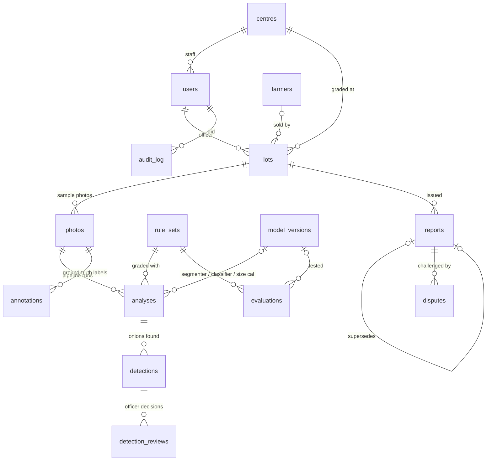

# Database schema

PostgreSQL 14 or newer. The DDL is in [`db/schema.sql`](../db/schema.sql), generated from `backend/app/models.py` by `python -m backend.app.dump_schema`; a test fails if the two drift apart. There are 15 tables. Keys are UUIDs, except the audit log's.

## Entity relationships



## Tables

| Table | One row is | Key columns | Written by |
| --- | --- | --- | --- |
| `centres` | a procurement centre | `code` (unique), `name`, `district`, `state`, `lat`, `lon` | admin |
| `users` | a person who signs in | `login` (unique), `password_hash`, `role` ∈ officer / supervisor / labeller / admin, `centre_id` | admin |
| `farmers` | a seller | `name`, `phone?`, `village`, `consent_at` (required before storing) | officer |
| `rule_sets` | a version of the grading rules | `version` (unique), `params` (JSONB: size limits, condition → grade), `source_note`, `is_active` (only one) | supervisor |
| `model_versions` | a trained model file | `kind` ∈ segmenter / classifier / size_calibration, `backend`, `version`, `file_sha256`, `metrics`, `is_active` (one per kind) | supervisor |
| `lots` | a consignment brought for grading | `lot_code` (unique), `centre_id`, `officer_id`, `farmer_id?`, `variety`, `status` ∈ open / graded / reported / disputed / closed | officer |
| `photos` | an uploaded photo | `sha256`, `storage_path`, `width`, `height`, `purpose` ∈ lot / dataset, `lot_id?`, `split` ∈ unassigned / train / val / test, `split_group` | officer, labeller |
| `analyses` | one pipeline run on one photo | `photo_id`, `rule_set_id`, `segmenter/classifier/size_cal_version_id`, `scale_found`, `calibration` (JSONB), `summary`, `timing_ms` | API |
| `detections` | one onion the pipeline found | `analysis_id`, `idx`, `polygon` (photo pixels), `diameter_mm`, `condition`, `proba`, `grade`, `label`, `needs_review`, `reasons`, `features` | API |
| `detection_reviews` | an officer's decision on one onion | `detection_id`, `reviewer_id`, `condition`, `diameter_mm?`, `note` (latest wins) | officer |
| `annotations` | a ground-truth onion for training / evaluation | `photo_id`, `polygon`, `condition`, `ruler_mm?`, `source` ∈ manual / prelabel / import / review | labeller |
| `reports` | an issued quality report | `lot_id`, `record` (JSONB), `canonical` (exact hashed text), `record_sha256` (unique), `status` ∈ valid / superseded, `supersedes_id` | officer |
| `disputes` | a challenge to a report | `report_id`, `raised_by_name/role`, `reason`, `status` ∈ open / regraded / upheld / rejected, `new_report_id` | anyone signed in; supervisor resolves |
| `evaluations` | test-split results of a model combination | model version ids, `rule_set_id`, `split`, `n_photos`, `metrics` (JSONB) | supervisor |
| `audit_log` | an action | `actor_id`, `action`, `entity`, `entity_id`, `detail`, `at` | API |

## Rules the schema enforces

- **Append-only history.** A re-analysis adds an `analyses` row. A re-grade adds a `reports` row that supersedes the old one. Rule sets and model versions are new rows, never edits. So any old report can be explained exactly.
- **One active rule set, one active model per kind:** partial unique indexes `uq_rule_sets_one_active` and `uq_model_versions_one_active_per_kind`.
- **No duplicate dataset photos:** partial unique index on `photos.sha256` where `purpose = 'dataset'`.
- **Closed vocabularies** (roles, conditions, grades, statuses) are CHECK constraints.
- **Model output, officer decisions and training truth are three different tables** (`detections`, `detection_reviews`, `annotations`). The model is never silently "corrected", and training data is never mixed with unreviewed predictions.

## Where a number on a report comes from

`reports.record.onions[i]` ← `detections` (the pipeline's polygon, size, condition) ← latest `detection_reviews` row if one exists ← graded with the `rule_sets` row named in `record.rule_set.version`. The models used are in `analyses.*_version_id`. The photo bytes hash to `photos.sha256`, and that hash is inside the fingerprinted record.

## Useful queries

```sql
-- how often officers overrule the model, per condition (a live accuracy signal after deployment)
SELECT d.condition AS model_said, r.condition AS officer_said, count(*)
FROM detection_reviews r JOIN detections d ON d.id = r.detection_id
GROUP BY 1, 2 ORDER BY 3 DESC;

-- Grade A share per centre per day
SELECT c.code, date(rep.issued_at) AS day, avg((rep.record->'summary'->'pct'->>'Grade A')::float) AS grade_a_pct
FROM reports rep JOIN lots l ON l.id = rep.lot_id JOIN centres c ON c.id = l.centre_id
WHERE rep.status = 'valid' GROUP BY 1, 2 ORDER BY 2 DESC;

-- labelled onions per condition and split (is the dataset balanced enough?)
SELECT p.split, a.condition, count(*) FROM annotations a JOIN photos p ON p.id = a.photo_id GROUP BY 1, 2 ORDER BY 1, 2;
```
