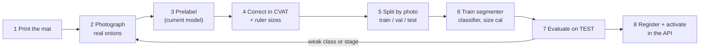

# How to train EkMaap on real onions

The demo's hand-set rules are starting values that have not been tuned on real photographs. Tuning requires data. You photograph and label real onions, train the models on part of them, and measure them on photos they never saw. Every step below is a script in `scripts/`, and every number you may quote comes out of `scripts/evaluate.py`.



## 0. First, find out WHICH stage fails on your photos

Poor results can come from four different stages, and each needs a different fix. Run the current pipeline on 5–10 of your real photos and look at the annotated output (`scripts/prelabel.py` prints whether the mat was found; the officer app draws outlines):

| What you see | Stage | Fix |
| --- | --- | --- |
| "mat not found", no sizes | calibration | print `ekmaap_mat.pdf` at 100%; all 4 markers visible, flat, not glossy-reflecting |
| outlines include shadows or the sheet; onions missed or merged | segmentation | train the pixel-forest segmenter (step 6a); plain matte sheet; diffuse light |
| sizes consistently too big or too small | size | ruler data + `fit_size_calibration.py` (step 6c) |
| outlines fine, wrong sound/rotten/sprouted/damaged | condition | label conditions and train the classifier (step 6b) |

## 1. Print the mat

```bash
python scripts/make_mat.py --out ekmaap_mat.pdf
```
Print on A4 at **100% / actual size**, then check the 100 mm bar with a ruler. Its four ArUco markers give scale and tilt correction. Laminating it (matte, not glossy) makes it last in a mandi.

## 2. Photograph real onions

- One layer of onions between the markers, not touching the markers. Touching each other is fine; that is realistic and the model must learn it.
- Phone roughly straight above, all 4 markers in frame, no flash, shade or diffuse daylight.
- **Vary what will vary in the field:** different days, times, light, phones, onion batches. Record the day as the photo's *group*; a whole group stays in one split, so the test measures a new day, not a copy of the training day.
- **Deliberately include defects:** buy rejected onions (sprouted, rotten, cut, peeled, small). A class with ten examples cannot be learned.
- Measure some onions with a ruler or caliper (widest diameter across the equator), and note which onion in which photo.

Starting targets (a place to start, not a guarantee; the evaluation tells you if it is enough):

| | Minimum to start | Better |
| --- | --- | --- |
| Photos | 40, over 3+ days | 150+, over 10+ days / 2+ phones |
| Onions per condition | 30 of each of sound, sprouted, damaged, rotten | 150+ each |
| Ruler-measured onions | 40 | 150+ |

Upload them with the officer app's Dataset tab, or `POST /api/v1/dataset/photos` with `split_group` = the day.

## 3. Prelabel (don't draw from zero)

Either press **Prelabel** in the app (`POST /photos/{id}/prelabel?save=true`), or offline:
```bash
python scripts/prelabel.py --images data/raw/images --out data/raw/prelabels.json
```
This writes the current model's outlines and conditions as a COCO file. Early on they will be poor; they still save drawing time.

## 4. Correct the labels in CVAT

CVAT is free and self-hostable (see its docs for `docker compose up`).
1. Create a project with the labels **sound, sprouted, damaged, rotten** (polygon).
2. Create a task with your photos and upload the prelabel file: *Actions → Upload annotations → COCO 1.0*.
3. Fix every outline (the whole visible bulb, **excluding** a long dried neck or loose roots) and set each onion's condition.
4. Export as *COCO 1.0*, and import it: `POST /api/v1/dataset/import` or the app's Dataset tab.
5. Type ruler sizes into `ruler.csv` (`file_name,x,y,ruler_mm`, where x,y is a point inside that onion), or send them with `PUT /photos/{id}/annotations` (`ruler_mm`).

Labelling rules that keep the data consistent: decide borderline cases together once, and write the decision down. For example, "any green shoot visible = sprouted" or "peeled outer skin only = sound; cut into flesh = damaged". Two labellers should label the same 5 photos and compare. Their disagreement is the best any model can reach, and it is also the PS's "subjectivity" measured.

## 5. Split by photo

```bash
curl -X POST .../api/v1/dataset/split -H "Authorization: Bearer $TOKEN" -H 'Content-Type: application/json' -d '{}'
curl -o dataset.zip .../api/v1/dataset/export -H "Authorization: Bearer $TOKEN" && unzip dataset.zip -d data/real
```
Splits are by photo, or by group, never by onion: onions in one photo share light and camera and would leak. The **test** split is never used for training or tuning. Look at it only to report results.

## 6. Train (CPU is enough for these three)

```bash
D=data/real
# 6a. segmenter: which pixels are onion / onion boundary / background   (~2 min per 25 photos on 2 CPU cores)
python scripts/train_segmenter.py --coco $D/annotations.json --images $D/images --out models/seg_pf_v1.joblib
# 6b. condition classifier: learns from labelled outlines AND the segmenter's outlines of the same onions
python scripts/train_classifier.py --coco $D/annotations.json --images $D/images --segmenter models/seg_pf_v1.joblib --out models/clf_v1.joblib
# 6c. size correction from ruler data (refuses to save if it does not reduce held-out error)
python scripts/fit_size_calibration.py --coco $D/annotations.json --images $D/images --ruler $D/ruler.csv --segmenter models/seg_pf_v1.joblib --out models/size_v1.json
```
`train_classifier.py` prints grouped cross-validation per condition (whole photos held out). Low recall on a condition means you need more examples of it.

## 7. Evaluate on the test split: the only numbers to quote

```bash
python scripts/evaluate.py --coco $D/annotations.json --images $D/images --ruler $D/ruler.csv \
  --segmenter models/seg_pf_v1.joblib --classifier models/clf_v1.joblib --size-cal models/size_v1.json \
  --out reports/eval_v1_test.json          # also writes reports/eval_v1_test.md
```
Also run it once with no model arguments. That is the untrained baseline, and the gap between the two runs is your improvement. Report: onions found / missed / extra, size error vs ruler (mm), recall per condition, Grade A % error per photo, share sent to review, **and the number of test photos and onions**.

## 8. Put the models into the app

```bash
for spec in "segmenter pixel_forest seg_pf_v1 models/seg_pf_v1.joblib" \
            "classifier sklearn clf_v1 models/clf_v1.joblib" \
            "size_calibration linear size_v1 models/size_v1.json"; do
  set -- $spec
  curl -X POST .../api/v1/models -H "Authorization: Bearer $TOKEN" \
       -F kind=$1 -F backend=$2 -F version=$3 -F file=@$4 -F metrics=@reports/eval_v1_test.json
done
# then POST /api/v1/models/{id}/activate for each, and POST /api/v1/evaluations {"split":"test"} to re-check inside the server
```
The API test-loads every file before accepting it. Old analyses keep pointing to the model versions that produced them.

## 9. Keep improving

- Every officer correction (`detection_reviews`) is a free new label. Periodically copy reviewed lot photos into the dataset, label them, and retrain.
- Watch the model-vs-officer disagreement query in `docs/database.md`. It is the live accuracy signal after deployment.
- Retrain when a new variety, season, centre or phone type appears.

## Optional: a GPU segmentation model (YOLO-seg)

When you have a few hundred labelled photos and the pixel forest still merges or misses onions:
```bash
python scripts/coco_to_yolo.py --coco $D/annotations.json --images $D/images --out data/yolo
pip install ultralytics                       # needs PyTorch; use Colab / Kaggle GPU
python scripts/train_yolo_seg.py --data data/yolo/data.yaml --out models/yolo
```
`notebooks/train_yolo_colab.ipynb` runs these steps on Colab. Register `best.pt` as `kind=segmenter backend=yolo_seg` and compare it with `evaluate.py` on the same test split. **This path has not been exercised in this repository's tests** (PyTorch is not part of the test environment). Ultralytics is AGPL-3.0: fine for an open-source hackathon repo, but a government deployment would need AGPL compliance or a commercial licence.

## What has and has not been verified

| Verified by running | Not verified |
| --- | --- |
| Every script above, end to end, on a **synthetic** dataset (30 generated photos). On the 4-photo synthetic test split, the untrained baseline found 26/28 onions (3.87 mm mean size error vs ruler, 21/26 conditions right); after training, 28/28 found, 0.20 mm size error, 26/28 conditions right. | Any of this on real onions: no real labelled data exists yet |
| API + PostgreSQL: 11 automated tests (grading, review, report, verify, tamper detection, dispute/supersede, dataset export/import, model registry, evaluation) | YOLO-seg training and inference |
| Officer web app driven in a real browser (desktop and phone width) | Docker image build (no package index access while building), CVAT round trip with a real CVAT export |

Synthetic photos are drawn by our own code, so good scores on them only show the code works.
